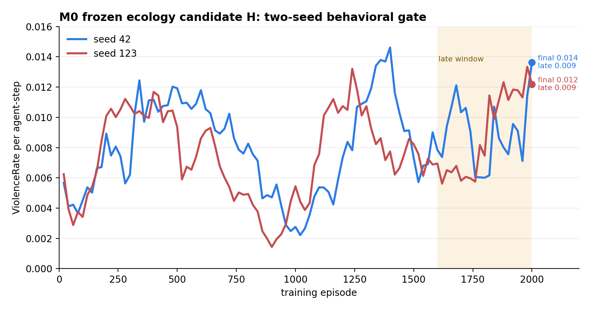
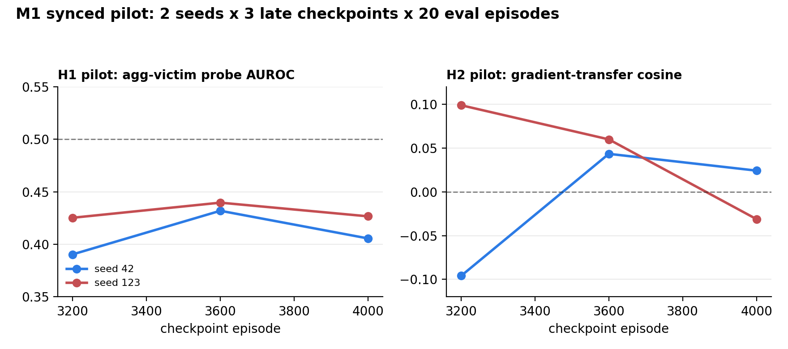
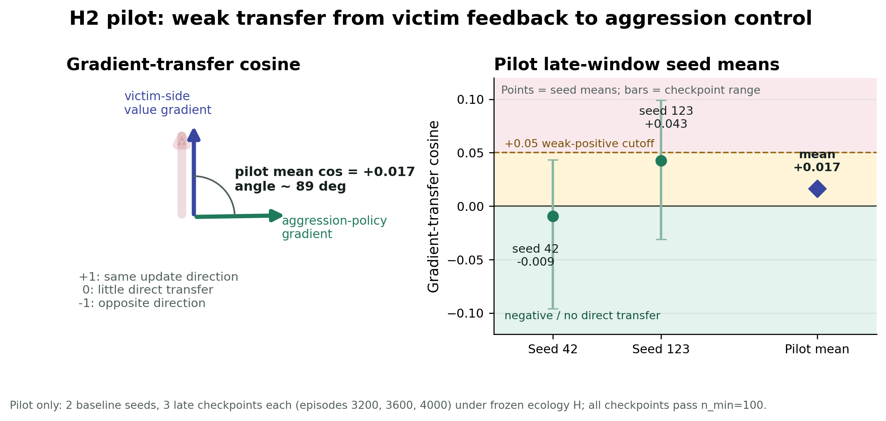

# Situated Agency Alignment

**CARMA — Cross-Role Alignment of Representations in Multi-Agent Systems**

A contrastive cross-role representation-binding intervention, with mechanism
probes for multi-agent reinforcement learning under resource conflict.

[](LICENSE)
[](https://pytorch.org/)
[](https://pettingzoo.farama.org/)

> **Evidence boundary:** M0 is a completed two-seed behavioral ecology gate.
> M1 is a two-seed mechanism pilot. The five-seed M1 confirmation and all M2
> intervention comparisons are pending. No current result establishes that
> CARMA reduces aggression, improves cooperation, or preserves capability.

## Overview

This repository asks a mechanism-level alignment question: when one recurrent
policy experiences both sides of a harmful interaction, does value information
learned while the policy is harmed transfer into restraint when the same policy
occupies the aggressor role?

CARMA tests one possible intervention. It adds a Siamese projector to a shared
PPO-LSTM actor-critic and binds representations of `ZAP_AGENT` (causing harm)
and `BEING_ZAPPED` (receiving harm). The working hypothesis is that explicit
cross-role binding may allow victim-side value information to influence
aggression-related policy updates. This is a testable hypothesis, not an
established property of the architecture.

The repository is the agent-side computational component of a broader Situated
Agency Alignment programme. The human-side programme studies **calibrated
agency**: whether felt authorship remains appropriately coupled to effective
influence, awareness of a system's contribution, genuine options, and usable
opportunities for correction. Its safety concern is the **Proxy Agency Safety
Shield**: a personalized agent's actions may feel self-authored even when that
fluency delays error detection or intervention. The code here does not test
that human-side claim; it first isolates an agent-side mechanism in a controlled
multi-agent commons.

## Research Question

In a resource-constrained commons, instrumental aggression can emerge even
when harming another agent receives no direct reward. CARMA investigates a
candidate **cross-role transfer gap**:

- the policy receives negative value information when it is harmed;
- the same policy can later act as the aggressor; but
- victim-side value gradients may not spontaneously align with the gradients
  that would reduce aggression.

The project therefore separates three levels of evidence:

1. **Ecology:** does the environment produce sustained instrumental aggression?
2. **Mechanism:** is cross-role value transfer weak in the baseline policy?
3. **Intervention:** does changing the representation or credit route alter both
   the proposed mechanism and behavior without destroying useful performance?

The study order is fixed: **replicate aggression → freeze the ecology → test the
transfer gap → only then evaluate CARMA**.

## Study Status

| Stage | Question | Current status | Canonical artifact |
|---|---|---|---|
| **M0: ecology calibration** | Can Env A sustain instrumental zapping without direct zap reward or victim penalty? | Completed as a two-seed behavioral gate; candidate H is frozen for M1 and M2. | [`manifests/m0_ecology_calibration.yaml`](manifests/m0_ecology_calibration.yaml) |
| **M1: baseline mechanism** | Under the frozen ecology, are aggressor/victim states separable, and does victim-side value feedback transfer into aggression-control updates? | Two-seed pilot only; five-seed confirmation is pending. | [`summary_m1_mechanism.json`](results/synced_external/m0_gate_H/m1_pilot_figures_seed42_123/summary_m1_mechanism.json) |
| **M2: mechanism discrimination** | Do meaningful role binding, scrambled binding, and direct credit routing produce different transfer, behavior, and capability profiles? | CARMA is configured. The current scrambled control must be corrected for Env A; direct routing is planned but not implemented. No confirmatory result exists. | [`manifests/m2_intervention.yaml`](manifests/m2_intervention.yaml) |

## M0: Frozen Ecology

M0 used behavioral measures only to select Env A candidate H:

```text
num_agents=6
apple_density=0.30
regrowth_speed=0.75
zap_timeout=25
zap_agent_reward=0.0
victim_penalty=0.0
waste/cleanup disabled
```

Across seeds 42 and 123, the selected cell sustained late-window violence
without complete harvest collapse. Mean late violence was `0.0089` per
agent-step, mean final violence was `0.0129`, and mean late return was `8.17`
apples per agent.



This is a behavioral gate, not a test of CARMA. Representation probes and
intervention outcomes were not used to choose the ecology.

## M1: Frozen-Ecology Pilot

The public M1 pilot uses two baseline seeds, three late checkpoints per seed
(`3200`, `3600`, and `4000`), 20 evaluation episodes per checkpoint, and
`n_min=100` for eligible aggressor/victim comparisons.



| Diagnostic | Pilot mean | 95% bootstrap interval over seed means | Bounded interpretation |
|---|---:|---:|---|
| H1 aggressor-victim probe AUROC | `0.420` | `[0.409, 0.431]` | Does not support strong linear separability in this pilot. |
| H2 cross-role gradient-transfer cosine | `0.017` | `[-0.009, 0.043]` | Consistent with weak or absent direct gradient transfer and motivates an intervention test. |



These results have important limits:

- H1 does not show that aggressor and victim states are identical, orthogonal,
  or generally inseparable. The initial probe pools perceptually similar
  contexts, uses a linear readout, and may distribute victim-state information
  across the timeout window. H1 remains inconclusive pending corrected probes.
- H2 is a diagnostic association, not a causal demonstration. A near-zero
  cosine does not establish that missing transfer causes aggression.
- With only two seeds, neither estimate is confirmatory. The preregistered next
  step is the five-seed baseline run under the same frozen ecology and analysis
  rules.

## M2: CARMA and Competing Mechanisms

The implemented CARMA condition uses a representation-binding loss between
batch centroids for the aggressor and victim roles:

```text
encoder → Siamese projector → PPO-LSTM actor-critic
                         ↘ role-binding loss

CARMA: ZAP_AGENT ↔ BEING_ZAPPED
```

The final mechanism-discrimination design should compare four arms under the
same frozen ecology, seed set, training budget, and evaluation pipeline:

| Arm | Intervention | Diagnostic purpose | Repository status |
|---|---|---|---|
| **Baseline** | No representation-binding loss | Estimates spontaneous cross-role transfer and behavior. | Implemented |
| **Meaningful binding (CARMA)** | Bind `ZAP_AGENT` to `BEING_ZAPPED` | Tests whether semantically matched cross-role binding changes transfer and behavior. | Configured; not yet tested confirmatorily |
| **Scrambled binding** | Apply a frequency- and scale-matched binding to a semantically unrelated event available in Env A, such as `APPLE_EATEN` | Separates semantic specificity from generic regularization or representation compression. | Planned correction |
| **Direct credit routing** | Route victim-side cost into aggression-related updates without mirror binding | Separates a representation-binding account from a credit-assignment account. | Planned; not implemented |

The pattern across arms matters more than a single headline metric:

- If meaningful binding changes both transfer and harmful behavior while the
  scrambled arm does not, that supports semantic specificity.
- If meaningful and scrambled binding perform similarly, the role-relational
  interpretation is weakened.
- If direct routing changes behavior without comparable representational
  convergence, the main bottleneck may be credit assignment.
- If aggression falls only because task reward, sustainability, coordination,
  or adaptation collapses, the intervention has not demonstrated useful
  alignment.
- If an internal overlap or transfer metric improves while harmful behavior
  returns, the metric has decoupled from the behavior it was meant to track.

### Current implementation boundary

The existing `broken` mode binds `ZAP_AGENT` to `ZAP_WASTE`, but the frozen Env
A ecology disables waste events. That condition is therefore not a valid
scrambled control for confirmatory Env A experiments. The config is retained as
an implementation placeholder and for the future dual-use Env B/M2′ branch; it
should not be interpreted as a completed control.

A direct actor-side penalty may be useful as an additional behavioral benchmark,
but it is not equivalent to direct credit routing. Any such benchmark should be
separately configured, preregistered, and evaluated for both harm reduction and
capability cost.

## Evaluation

Behavioral and mechanism-level measures should be reported together:

- `ViolenceRate_per_agent_step` and `BeingZappedRate_per_agent_step`;
- apple consumption, average return, and sustainability;
- aggressor/victim role-event counts and probe eligibility;
- cross-role gradient-transfer cosine;
- pre/post representation diagnostics;
- coordination, adaptation, and held-out-ecology generalization; and
- intervention cost or capability loss.

No internal alignment metric is treated as sufficient evidence without a
corresponding behavioral test, and no behavioral reduction in harm is treated
as sufficient if it is explained by reward suppression or capability collapse.

## Reproducing the Current Public Paths

Clone and install:

```bash
git clone https://github.com/tapasiitk/situated-agency-alignment.git
cd situated-agency-alignment
pip install -r requirements.txt
```

Run the selected M0 ecology cell:

```bash
python train_karma.py \
  --config configs/stage0_env_A_H_n6_ad030_rg075_zt25.yaml \
  --mode baseline \
  --seed 42
```

Run an M1 baseline seed under the frozen ecology:

```bash
python train_karma.py \
  --config configs/m1_env_A_frozen_n6_ad030_rg075_zt25.yaml \
  --mode baseline \
  --seed 42
```

Run the configured CARMA condition for development or preregistration checks.
The current command-line mode remains `karma` for backward compatibility:

```bash
python train_karma.py \
  --config configs/m2_intervention/m2_env_A_frozen_n6_ad030_rg075_zt25_karma.yaml \
  --mode karma \
  --seed 42
```

Do not treat a single run as confirmatory. The study manifests define the seed
sets, checkpoint cadence, evaluation budget, and analysis thresholds.

Postprocessing entry points:

- [`scripts/rollout_from_checkpoint.py`](scripts/rollout_from_checkpoint.py)
- [`scripts/analyze_checkpoint.py`](scripts/analyze_checkpoint.py)
- [`scripts/aggregate_m1.py`](scripts/aggregate_m1.py)
- [`scripts/plot_m0_ecology_calibration.py`](scripts/plot_m0_ecology_calibration.py)
- [`scripts/plot_m1_mechanism_frozen_ecology.py`](scripts/plot_m1_mechanism_frozen_ecology.py)

## Repository Map

```text
situated-agency-alignment/
├── karmic_rl/
│   ├── envs/harvest_dual.py        # PettingZoo commons environment
│   └── agents/karma_agent.py       # CNN/projector/PPO-LSTM policy
├── train_karma.py                  # Training entry point
├── configs/
│   ├── m0_ecology_calibration/     # M0 configuration view
│   ├── m1_frozen_mechanism/        # M1 configuration view
│   └── m2_intervention/            # M2 intervention configs
├── manifests/                      # Stage-level run specifications
├── scripts/                        # Rollout, analysis, aggregation, plotting
├── docs/
│   ├── meta/                       # Human-side theory artifacts
│   ├── M1_2_related/               # Computational design records
│   └── assets/readme/              # Figures shown in this README
└── results/                        # Lightweight summaries and figures
```

Large checkpoints and rollout files are intentionally excluded from version
control. Public summaries, final figures, manifests, and analysis code define
the lightweight reproducibility record.

## Roadmap

Near-term priorities:

- complete the five-seed M1 baseline confirmation under the frozen ecology;
- correct the Env A scrambled-binding condition and document how intervention
  frequency and scale are matched;
- implement the direct credit-routing diagnostic;
- preregister and run the four-arm M2 comparison;
- measure transfer, harm, reward, sustainability, coordination, and adaptation
  jointly; and
- test generalization in held-out ecologies and after annealing or removing the
  binding loss.

Longer-term extensions include plural-value settings, asymmetric roles,
norm-formation and cultural-transmission dynamics, the dual-use Env B/M2′
selective-suppression study, and human experiments on personalization,
authorship, reliance calibration, error detection, and override behavior.

## What to Read First

- Theory frame: [`docs/meta/T1_proxy_agency_moral_shieldv3_minds_machines.pdf`](docs/meta/T1_proxy_agency_moral_shieldv3_minds_machines.pdf)
- Living computational design record: [`docs/M1_2_related/design_decisions.md`](docs/M1_2_related/design_decisions.md)
- M0 calibration protocol: [`docs/M1_2_related/M0_behavioral_ecology_calibration.md`](docs/M1_2_related/M0_behavioral_ecology_calibration.md)
- M1 refactor handoff: [`docs/M1_2_related/M1_KT_ecology_mechanism_refactor.md`](docs/M1_2_related/M1_KT_ecology_mechanism_refactor.md)
- Results layout: [`results/README.md`](results/README.md)

## Citation

```bibtex
@misc{rath2026situatedAgencyAlignment,
  title  = {Situated Agency Alignment: CARMA and Cross-Role Value Transfer in Multi-Agent Reinforcement Learning},
  author = {Rath, Tapas Ranjan},
  year   = {2026},
  note   = {Research code and pilot results},
  url    = {https://github.com/tapasiitk/situated-agency-alignment}
}
```

## Maintainer

**Tapas Ranjan Rath** — [research profile](https://tapasiitk.github.io/)

## License

MIT License. See [`LICENSE`](LICENSE).
