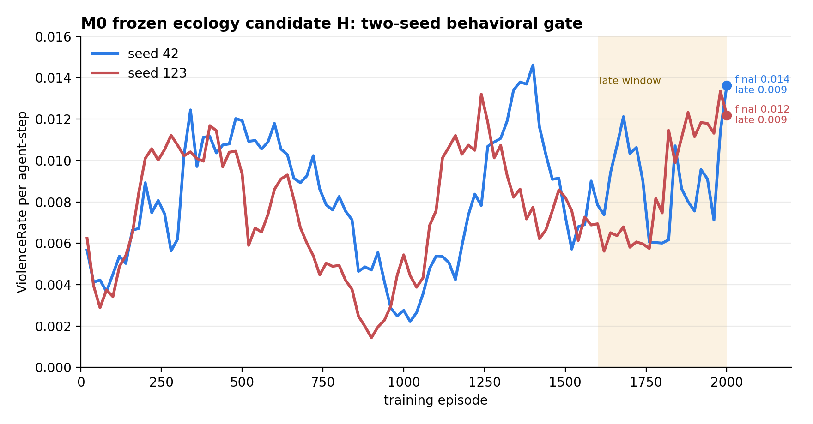
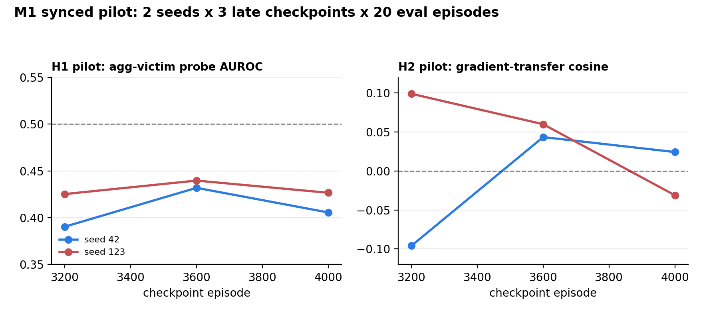
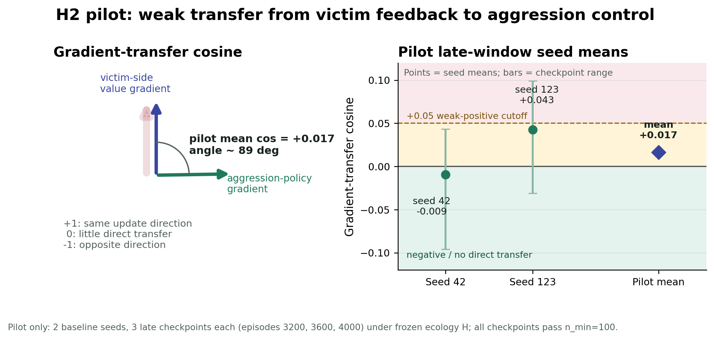

# Situated Agency Alignment

Computational probes for **AI alignment under plural, conflicting, and evolving
human values**. The broader research question is how societies solve multi-agent
alignment problems through cooperation, norms, institutions, moral cognition, and
cultural transmission, and what analogous mechanisms might be engineered into AI
systems.

This repository is the current computational slice of that program. It focuses
on the **Proxy Agency moral shield**: when a personalized agent acts fluently
enough to feel like an extension of the user, harmful strategic drift may become
harder to notice as a moral violation.

It develops **KARMA** (**K**nowledge-guided **A**lignment via
**R**ole-invariant **M**irror **A**rchitecture), a candidate representational
intervention for multi-agent alignment.

It is also the public computational companion to the T1v3 theory draft,
[`docs/meta/T1_proxy_agency_moral_shieldv3.md`](docs/meta/T1_proxy_agency_moral_shieldv3.md).
The theory paper separates the problem into two layers:

- **Tragedy layer:** competitive commons ecologies can make exclusionary
  aggression instrumentally useful.
- **Shield layer:** under Proxy Agency, the user may retain a sense of authorship
  while moral re-engagement is delayed.

The code here studies the agent-side tragedy/mechanism layer first. It
reproduces a commons aggression ecology, tests whether the baseline agent shows
an empathy-gap style mechanism, and then asks whether a role-invariant
representation intervention can suppress harm.

## Why Not Just Hard-Code It?

Hard constraints, warnings, filters, and override prompts are necessary in many
AI safety settings. But they do not answer the specific Proxy Agency problem.
The concern here is not only that an agent may choose an aggressive action; it is
that a personalized agent may drift into harmful strategies while the user still
experiences the strategy as fluent, competent, and self-authored.

In that setting, a visible block or warning can reduce harm, but it may do so by
breaking the very Sense of Agency (SoA) that made the system useful. The harder
question is whether an agent can learn a different **disposition**: a policy
whose internal representation makes harm-infliction less attractive before a
post-hoc veto is needed.

KARMA is aimed at that level. Instead of adding a rule like "never zap," it
tests whether binding the aggressor view (`ZAP_AGENT`) with the victim view
(`BEING_ZAPPED`) changes the learned representational substrate from which
action tendencies arise. The research target is therefore not merely behavioral
compliance, but architectural alignment: reducing harmful drift while preserving
agency, fluency, and useful autonomy where possible.

## Research Positioning

Human societies are living alignment systems: they coordinate many agents with
different interests, stabilize cooperation through norms and institutions, and
transmit moral expectations across generations. This project uses that analogy
as a design prompt for AI safety rather than as a metaphor only.

The near-term computational target is synchronic: build multi-agent worlds where
agents face cooperation, exclusion, and value-conflict pressures, then measure
how learned representations shape moral behavior. The longer-run target is
diachronic: model how user values, AI-mediated strategies, and shared norms
coevolve over cultural time.

This repo therefore sits at the intersection of:

- **Cooperative AI and MARL:** commons ecologies, resource conflict, exclusion,
  coordination, and intervention tests.
- **Computational moral cognition:** aggressor/victim role representations,
  value transfer, and moral recategorization under agency.
- **Cultural evolution of norms:** cooperation and norm enforcement as scalable
  alignment machinery, with the current codebase providing a minimal engineered
  substrate.
- **AI safety for personalized agents:** user-aligned agents may preserve sense
  of agency while drifting into strategies that harm others.

## Core Concepts

| Concept | Meaning in this repo |
|---|---|
| **Plural-values alignment** | AI agents may act for users with different, conflicting, and changing values; alignment must handle coordination and conflict, not only single-user preference following. |
| **Proxy Agency** | A user experiences an AI agent's actions as continuous with their own extended will when the agent is personalized and semantically fluent. |
| **Sense of Agency (SoA)** | The user's felt authorship over an action. The moral-shield risk is strongest when SoA remains high while harmful drift is not recategorized as a violation. |
| **Moral shield** | Harmful AI-mediated strategies may be slower to trigger moral scrutiny because they feel self-authored rather than alien or externally imposed. |
| **Tragedy layer** | A commons ecology where individually useful exclusion can emerge under resource pressure. |
| **Empathy-gap mechanism** | A candidate agent-side failure mode in which victim-side negative feedback does not transfer into aggressor-side restraint. |
| **Dispositional intervention** | A safety intervention aimed at the agent's learned representations and action tendencies, not only at blocking outputs after they are selected. |
| **KARMA** | Knowledge-guided Alignment via Role-invariant Mirror Architecture: a role-invariant representation intervention that explicitly binds aggressor and victim views. |

## Current Study Sequence

| Stage | Question | Status | Main artifact |
|---|---|---|---|
| **M0 ecology calibration** | Can Env A reproduce sustained instrumental zapping without direct zap reward or victim penalty? | Completed as a two-seed behavioral gate; candidate H is frozen for M1/M2. | [`manifests/m0_ecology_calibration.yaml`](manifests/m0_ecology_calibration.yaml) |
| **M1 frozen-ecology pilot** | Under the frozen ecology, do baseline PPO-LSTM agents show aggressor/victim role separation and weak cross-role value transfer? | Pilot only: 2 seeds, 3 late checkpoints each. H1 is not supported in this pilot; H2 suggests weak/no direct gradient transfer. | [`results/synced_external/m0_gate_H/m1_pilot_figures_seed42_123/summary_m1_mechanism.json`](results/synced_external/m0_gate_H/m1_pilot_figures_seed42_123/summary_m1_mechanism.json) |
| **M2 KARMA intervention idea** | Does binding `ZAP_AGENT` with `BEING_ZAPPED` reduce harm-infliction relative to baseline and a scrambled control? | Designed, not yet a confirmatory result. | [`manifests/m2_intervention.yaml`](manifests/m2_intervention.yaml) |

Short form: **replicate aggression -> freeze ecology -> test empathy gap -> only
then KARMA**.

## M0: Frozen Ecology

M0 selected Env A candidate H:

```text
num_agents=6
apple_density=0.30
regrowth_speed=0.75
zap_timeout=25
zap_agent_reward=0.0
victim_penalty=0.0
waste/cleanup disabled
```

Across seeds 42 and 123, candidate H produced sustained late-window violence
without complete harvest collapse: mean late violence was `0.0089` per
agent-step, mean final violence was `0.0129`, and mean late return was `8.17`
apples per agent.



The M0 gate is behavior-only by design. Probe metrics, representation geometry,
and KARMA intervention results are not used to choose the ecology.

## M1: Frozen-Ecology Pilot

M1 keeps the ecology fixed and measures the baseline mechanism in late learned
policy checkpoints. The current pilot uses 2 baseline seeds, 3 late checkpoints
per seed (`3200`, `3600`, `4000`), 20 evaluation episodes per checkpoint, and
`n_min=100` for aggressor/victim role comparisons.



Pilot summary:

| Metric | Late-window pilot mean | 95% bootstrap interval over seed means | Interpretation |
|---|---:|---:|---|
| H1 aggressor-victim probe AUROC | `0.420` | `[0.409, 0.431]` | Does **not** support a strong separability claim in this two-seed pilot. |
| H2 gradient-transfer cosine | `0.017` | `[-0.009, 0.043]` | Suggests weak/no direct transfer from victim-side value feedback into aggression-control updates. |



This is intentionally framed as a pilot, not a completed confirmatory M1. The
next defensible M1 step is the manifest run: five baseline seeds under the same
frozen ecology, with the same late-window and `n_min` rules.

## M2: KARMA Intervention Idea

KARMA (**K**nowledge-guided **A**lignment via **R**ole-invariant **M**irror
**A**rchitecture) adds a Siamese projector to a shared PPO-LSTM actor-critic and
applies a contrastive loss to role-labeled social events:

```text
baseline: no contrastive loss
KARMA:    ZAP_AGENT <-> BEING_ZAPPED
broken:   scrambled role binding control
```

The M2 hypothesis is narrow and testable: if victim-side feedback does not
naturally transfer into aggression restraint, then explicitly binding the
aggressor and victim representations should reduce `ZAP_AGENT` without merely
destroying foraging performance. In the broader program, this is one candidate
mechanism for aligning agents that act for different users while still needing to
coordinate, negotiate, and respect shared constraints.

This is why the intervention is located at the representational/dispositional
level. The goal is not to prove that aggression can be stopped by an external
ban. The goal is to test whether the learned policy can become less disposed to
harm while remaining an autonomous agent whose behavior can still feel fluent to
the user in later human-facing studies.

Implementation note: the current code's `broken` mode binds `ZAP_AGENT` to
`ZAP_WASTE`. That is appropriate for the future dual-use Env B/M2' branch, but
Env A disables waste. For Env A-only M2, the design record recommends a
scrambled control such as `ZAP_AGENT <-> APPLE_EATEN` before treating the broken
condition as confirmatory.

## Future Plans

The public `main` branch should stay focused on the clean research spine:
concepts, runnable code, configs/manifests, lightweight pilot summaries, and
figures needed to interpret the current results.

Near-term:

- Complete the planned five-seed M1 baseline under the frozen H ecology.
- Keep M1 confirmatory claims separate from the current two-seed pilot.
- Amend or clearly label the Env A Broken Mirror control before treating M2 as
  confirmatory, because Env A has no `ZAP_WASTE` events.
- Run M2 on the same frozen ecology and seed set, comparing baseline, KARMA, and
  the scrambled control on violence, apple return, role-event counts, and
  gradient-transfer diagnostics.

Next extensions:

- Add plural-value multi-agent scenarios where agents represent different users'
  values and must coordinate, negotiate, or resolve conflicts.
- Add norm-formation or cultural-transmission dynamics so values and strategies
  can change over simulated time.
- Reopen Env B/M2' once the dual-use cleanup/aggression ecology is stable enough
  to test selective suppression: reduce `ZAP_AGENT` while preserving useful
  cooperative beam use.
- Connect the computational work to human-facing Proxy Agency studies measuring
  sense of agency, strategy retention, moral endorsement, and override behavior.

## Running The Main Paths

Install:

```bash
pip install -r requirements.txt
```

Run the frozen M0 ecology cell:

```bash
python train_karma.py \
  --config configs/stage0_env_A_H_n6_ad030_rg075_zt25.yaml \
  --mode baseline \
  --seed 42
```

Run M1 baseline under the frozen ecology:

```bash
python train_karma.py \
  --config configs/m1_env_A_frozen_n6_ad030_rg075_zt25.yaml \
  --mode baseline \
  --seed 42
```

Run the planned M2 KARMA condition:

```bash
python train_karma.py \
  --config configs/m2_intervention/m2_env_A_frozen_n6_ad030_rg075_zt25_karma.yaml \
  --mode karma \
  --seed 42
```

Run the current M2 broken-mirror placeholder:

```bash
python train_karma.py \
  --config configs/m2_intervention/m2_env_A_frozen_n6_ad030_rg075_zt25_broken.yaml \
  --mode broken \
  --seed 42
```

Useful postprocessing entry points:

- [`scripts/plot_m0_ecology_calibration.py`](scripts/plot_m0_ecology_calibration.py)
- [`scripts/rollout_from_checkpoint.py`](scripts/rollout_from_checkpoint.py)
- [`scripts/analyze_checkpoint.py`](scripts/analyze_checkpoint.py)
- [`scripts/aggregate_m1.py`](scripts/aggregate_m1.py)
- [`scripts/plot_m1_mechanism_frozen_ecology.py`](scripts/plot_m1_mechanism_frozen_ecology.py)

## Repository Map

```text
situated-agency-alignment/
├── karmic_rl/
│   ├── envs/harvest_dual.py        # PettingZoo commons environment
│   └── agents/karma_agent.py       # PPO-LSTM + projector architecture
├── train_karma.py                  # Training entry point
├── configs/
│   ├── m0_ecology_calibration/     # M0 config view
│   ├── m1_frozen_mechanism/        # M1 frozen-ecology view
│   └── m2_intervention/            # M2 intervention configs
├── manifests/                      # Study run manifests
├── scripts/                        # Rollout, analysis, plotting helpers
├── docs/
│   ├── meta/                       # T1/T-series theory drafts
│   ├── M1_2_related/               # M0/M1/M2 design records
│   └── assets/readme/              # README figures
├── results/                        # Lightweight summaries and figures
└── run_logs/                       # Local run logs
```

## What To Read First

- Theory frame: [`docs/meta/T1_proxy_agency_moral_shieldv3.md`](docs/meta/T1_proxy_agency_moral_shieldv3.md)
- Living computational design record: [`docs/M1_2_related/design_decisions.md`](docs/M1_2_related/design_decisions.md)
- M0 calibration runbook: [`docs/M1_2_related/M0_behavioral_ecology_calibration.md`](docs/M1_2_related/M0_behavioral_ecology_calibration.md)
- M1 refactor handoff: [`docs/M1_2_related/M1_KT_ecology_mechanism_refactor.md`](docs/M1_2_related/M1_KT_ecology_mechanism_refactor.md)
- Results layout: [`results/README.md`](results/README.md)

## Citation

```bibtex
@misc{rath2026situatedAgencyAlignment,
  title  = {Situated Agency Alignment: Proxy Agency, Plural Values, and Role-Invariant MARL},
  author = {Rath, Tapas Ranjan},
  year   = {2026},
  note   = {Research code and pilot results},
  url    = {https://github.com/tapasiitk/situated-agency-alignment}
}
```

## License

MIT License. See [`LICENSE`](LICENSE).
