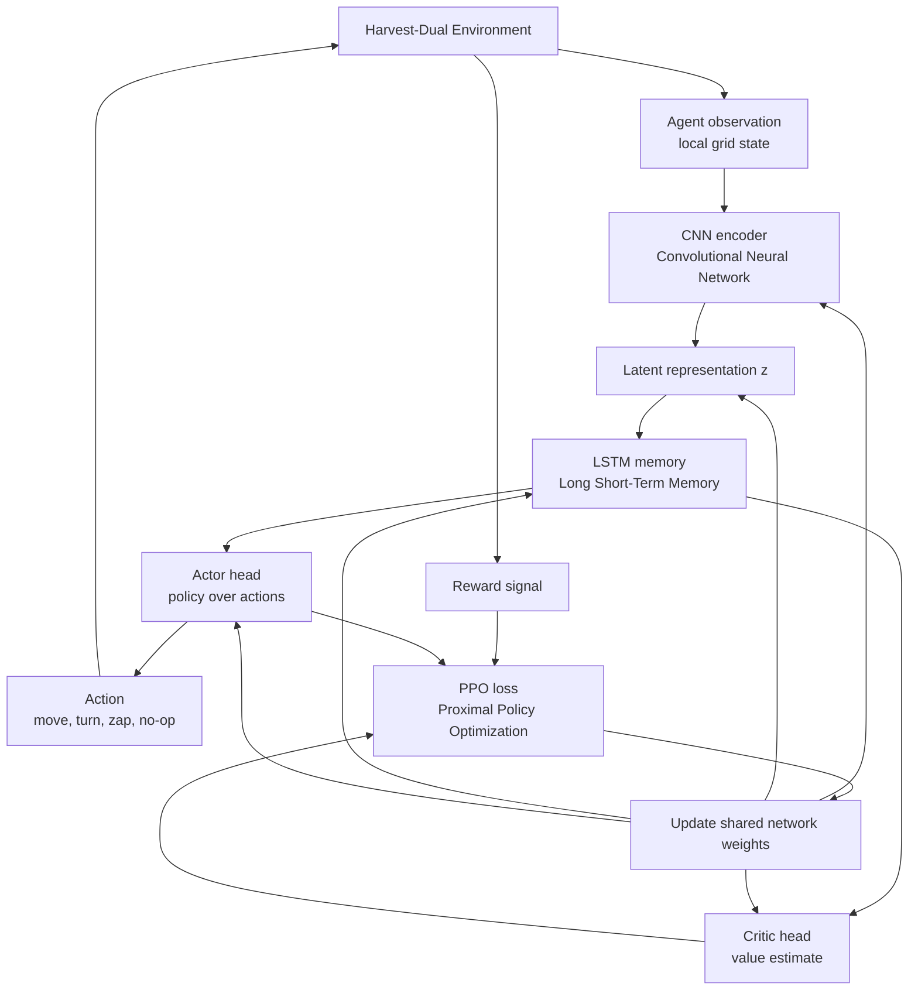
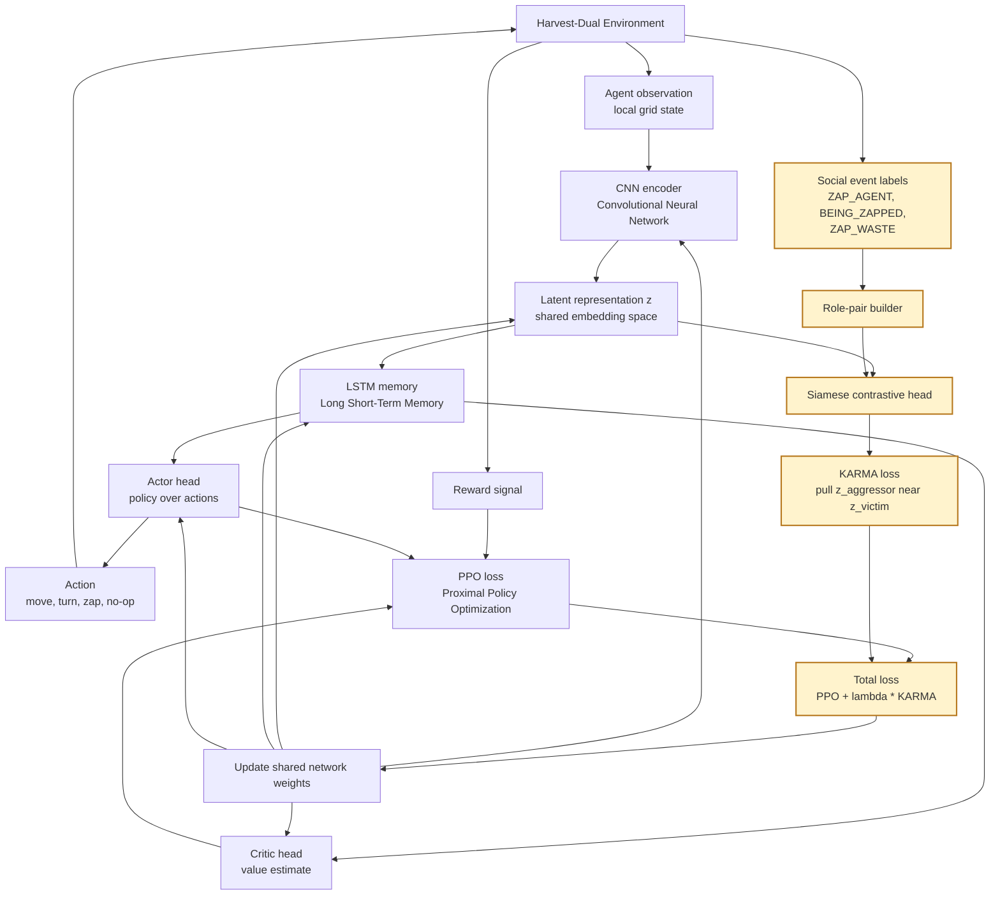

# KARMA-Free vs KARMA Architecture

This note explains the system architecture in two versions:

1. **KARMA-free architecture**: the ordinary reinforcement-learning agent.
2. **KARMA architecture**: the same agent with an added role-invariant
   contrastive training branch.

The goal is to keep the architecture story separate from the M1 analysis
pipeline. M1 can be explained as studying the KARMA-free system. M2 can be
explained as inserting the KARMA-specific branch into the same base system.

## Acronyms

| Term | Full form | Meaning here |
|---|---|---|
| RL | Reinforcement Learning | Learning by acting in an environment and receiving rewards. |
| DRL | Deep Reinforcement Learning | RL where policy and value functions are neural networks. |
| CNN | Convolutional Neural Network | Neural network block that encodes grid/image observations. |
| LSTM | Long Short-Term Memory | Recurrent memory block that carries short-term context within an episode. |
| PPO | Proximal Policy Optimization | Actor-critic RL algorithm used to update the policy and value network. |
| KARMA | Knowledge Acquisition via Role-Invariant Mirror Architecture | Proposed mechanism that links harm-inflicting and harm-receiving representations. |
| MSE | Mean Squared Error | Distance-like loss used to pull selected embeddings closer together. |

## KARMA-Free Architecture

In the KARMA-free system, the agent learns through the standard reinforcement
learning loop: observe, act, receive reward, and update with PPO. The
environment may record social events internally, but those events are not used
as an additional representation-learning signal.



## KARMA-Free Blocks

**Harvest-Dual Environment**

The environment is the multi-agent world. It contains agents, apples, waste,
walls, and the dual-use zap action. The same zap action can be used against
another agent or against waste.

**Agent Observation**

Each agent receives a local grid observation. This is the agent's partial view
of the world at the current timestep.

**CNN Encoder**

The Convolutional Neural Network converts the raw grid observation into a
feature vector. It extracts spatial information such as where apples, agents,
waste, and walls are.

**Latent Representation `z`**

This is the compressed internal representation used by later parts of the
agent. In the KARMA-free system, `z` is shaped only by the PPO objective. There
is no explicit instruction that "harming someone" and "being harmed" should be
represented similarly.

Implementation note: in the current code, the baseline still has the projector
that produces `z`. What is absent is the contrastive KARMA loss.

**LSTM Memory**

LSTM stands for Long Short-Term Memory. It lets the agent remember recent
context inside an episode. This matters because a single observation may not
show the full situation.

Examples of useful within-episode memory:

- another agent was nearby a few steps ago;
- the agent was moving toward an apple patch;
- the agent recently fired a zap;
- the agent was recently zapped.

The LSTM hidden state resets at the beginning of each episode. The learned
network weights carry across episodes.

**Actor Head**

The actor outputs the policy: a probability distribution over possible actions.
The selected action is sent back to the environment.

**Critic Head**

The critic estimates expected future return from the current internal state.
PPO uses this value estimate to decide whether outcomes were better or worse
than expected.

**Reward Signal**

The environment returns rewards and penalties based on what happened. These can
include apples eaten, zap costs, and any configured penalties or rewards.

**PPO Loss**

PPO stands for Proximal Policy Optimization. It is the reinforcement-learning
training objective. It updates:

- the actor, so useful actions become more likely;
- the critic, so value predictions become more accurate;
- the shared encoder and memory layers, so the agent builds better features for
  acting and value estimation.

## KARMA-Free Flow

1. The environment gives each agent an observation.
2. The CNN encodes the observation.
3. The latent representation `z` is passed into the LSTM memory.
4. The actor chooses an action and the critic estimates value.
5. The action changes the environment.
6. The environment returns reward.
7. PPO updates the network from collected experience.

The key limitation is that the agent can learn separate internal meanings for:

- "I zap another agent";
- "I am zapped by another agent".

Nothing in the KARMA-free objective forces those two situations to share a
representation.

## KARMA Architecture

KARMA keeps the same actor-critic reinforcement-learning system but adds one
extra training branch. That branch uses social event labels to build role pairs
and applies a contrastive loss to the latent representation `z`.



## KARMA-Specific Blocks

**Social Event Labels**

The environment records structured social events. These labels say what kind of
social role an agent occupied at a timestep.

| Event | Meaning |
|---|---|
| `ZAP_AGENT` | This agent harmed another agent. |
| `BEING_ZAPPED` | This agent was harmed by another agent. |
| `ZAP_WASTE` | This agent used zap to clean waste. |

In KARMA-free training, these labels are not used to shape the representation.
In KARMA training, they become the source of the extra contrastive signal.

**Role-Pair Builder**

This block decides which experiences should be linked in representation space.

For KARMA, the target pair is:

```text
aggressor view <-> victim view
```

In words:

```text
"I harm someone" should be represented near "I am harmed."
```

This is the central role-invariance idea.

For a broken-mirror control, the pair is intentionally wrong. In the current
code path, the broken condition pulls:

```text
aggressor view <-> cleaner view
```

That tests whether simply adding a contrastive head is enough, or whether the
semantic pairing must be correct.

**Siamese Contrastive Head**

"Siamese" means the same embedding function is applied to both sides of a
pair. The system does not build one network for aggressor states and another
for victim states. Instead, both are encoded into the same latent space `z`.

The head compares selected embeddings:

```text
z_aggressor
z_victim
```

and penalizes them if they are too far apart.

**KARMA Loss**

The KARMA loss is the extra representation-level objective. Conceptually:

```text
minimize distance(z_aggressor, z_victim)
```

In the current implementation, this is computed as Mean Squared Error between
the average aggressor embedding and the average victim embedding in a batch:

```text
L_KARMA = contrastive_weight * MSE(mean(z_aggressor), mean(z_victim))
```

**Total Loss**

The final training objective combines ordinary PPO loss with KARMA loss:

```text
L_total = L_PPO + lambda * L_KARMA
```

PPO still teaches the agent how to act. KARMA changes the geometry of the
representation that PPO learns on top of.

## KARMA Flow

1. The environment gives the agent an observation, reward signal, and social
   event labels.
2. The observation follows the normal path: CNN -> `z` -> LSTM -> actor/critic.
3. PPO computes the ordinary actor-critic loss from actions, rewards, and value
   predictions.
4. The social event labels identify role-relevant samples, such as aggressor
   and victim states.
5. The Siamese contrastive head compares their latent embeddings.
6. The KARMA loss pulls aggressor and victim embeddings closer together.
7. The total loss updates the shared network.

At inference time, the agent does not need an explicit rule saying "do not
harm." The policy still acts from observations through the actor. The
difference is that training has shaped the internal representation so that
harm-inflicting and harm-receiving states are no longer treated as unrelated.

## Core Difference

| Aspect | KARMA-free | KARMA |
|---|---|---|
| Main learning algorithm | PPO | PPO plus KARMA loss |
| Uses observations | Yes | Yes |
| Uses rewards | Yes | Yes |
| Uses social events for representation learning | No | Yes |
| Main latent geometry | Learned only for reward prediction and action selection | Also shaped by role-invariant contrastive pairing |
| Expected issue | Aggressor and victim states can remain separate | Aggressor and victim states are pulled together |
| Mechanism claim | Baseline system may show an empathy gap | KARMA should reduce the empathy gap by changing representation geometry |

## One-Sentence Summary

The KARMA-free agent learns actions from reward, while KARMA adds a
representation-level mirror signal that pushes "I harm" and "I am harmed" into
nearby regions of the agent's latent space.

